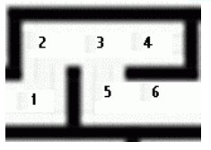
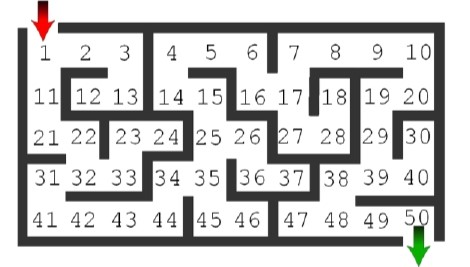

This program find the shortest path to solve the maze using breadth first search. The program takes the input from a directed graph.  

Example 1

The output is:
Start -> 1 -> 2 -> 3 -> 5 -> 6 -> Exit
Total cost: 6

Example 2

The output is :
Start -> 1 -> 11 -> 21 -> 22 -> 32 -> 31 -> 41 -> 42 -> 43 -> 44 -> 34 -> 35 -> 25 -> 15 -> 14 -> 4 -> 5 -> 6 -> 16 -> 1
7 -> 7 -> 8 -> 9 -> 10 -> 20 -> 19 -> 29 -> 39 -> 38 -> 48 -> 49 -> 50 -> Exit
Total cost: 33

We can traverse the maze backwards as well.

The output is:
Start -> 50 -> 49 -> 48 -> 38 -> 39 -> 29 -> 19 -> 20 -> 10 -> 9 -> 8 -> 7 -> 17 -> 16 -> 6 -> 5 -> 4 -> 14 -> 15 -> 25
-> 35 -> 34 -> 44 -> 43 -> 42 -> 41 -> 31 -> 32 -> 22 -> 21 -> 11 -> 1 -> Exit
Total cost: 33
